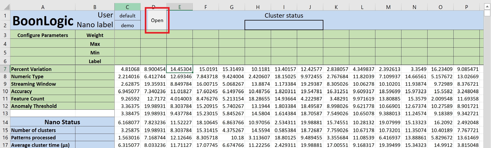
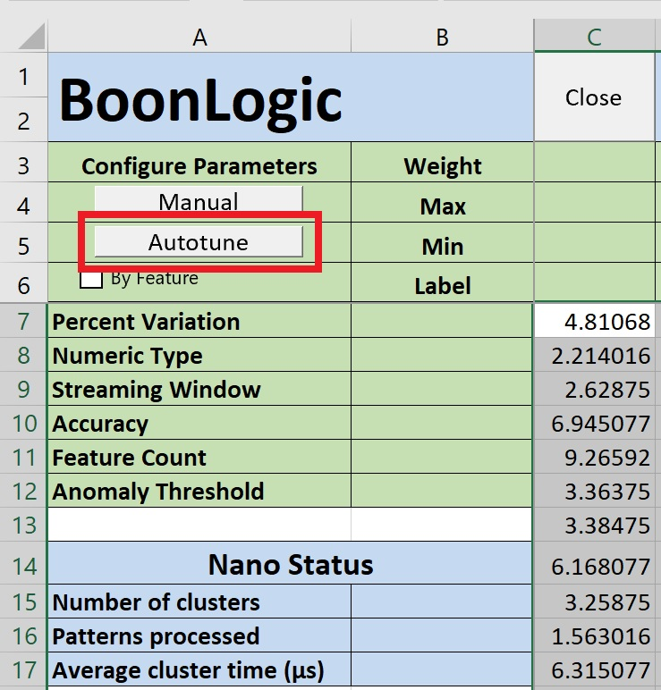

# Tutorial: General Pipeline
Use this tutorial to get the general steps for processing data using the Boon Nano Nano Saas  via the Excel Add-in

### Getting Set Up
For more detailed instructions on how to setup the authentication file and load the Excel Add-in, see the [README file](../README.md).

With your dataset open (or the [example dataset](../Data.xlsm)), running the Boonnano macro (either from the Quick Access Toolbar or from Visual Basic) will set up your notebook to look something like this:

### Using the Boon Nano
1. In the red box to the right of `Nano label`, fill in your unique instance name. This can be any string such as a username or a description of the data being processed on the instance.
>__NOTE:__ If using generic names such as `test` or `demo`, there is a risk of other users overwritting the data without knowing it

2. Once the Nano label is filled in, the boxes will have turned blue. Select `Open` to start up your instance.

If the instance opens correctly, two new buttons will appear on the lefthand side:

3. Select all the data you want to process (using shift + ctrl + arrow keys selects to the last column/row that has values). From there, select the `Autotune` button.

