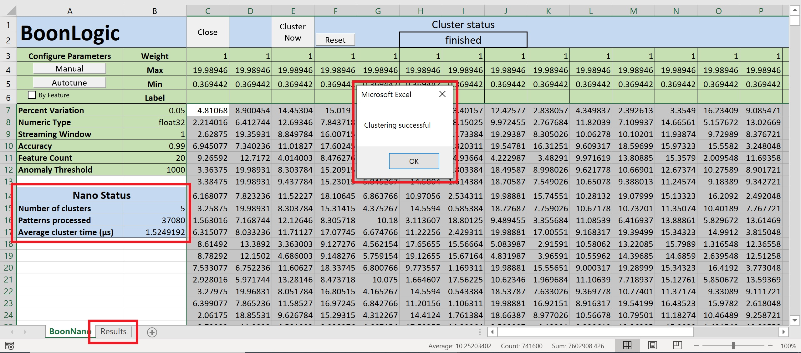

# Tutorial: General Pipeline
Use this tutorial to get the general steps for processing data using the Boon Nano Nano Saas  via the Excel Add-in

### Getting Set Up
For more detailed instructions on how to setup the authentication file and load the Excel Add-in, see the [README file](../README.md).

With your dataset open (or the [example dataset](../Data.xlsm)), running the Boonnano macro (either from the Quick Access Toolbar or from Visual Basic) will set up your notebook to look something like this:   

### Using the Boon Nano
1. In the red box to the right of `Nano label`, fill in your unique instance name. This can be any string such as a username or a description of the data being processed on the instance.
>__NOTE:__ If using generic names such as `test` or `demo`, there is a risk of other users overwritting the data without knowing it

2. Once the Nano label is filled in, the boxes will have turned blue. Select `Open` to start up your instance.   

If the instance opens correctly, two new buttons will appear on the lefthand side:   

3. Select all the data you want to process (using shift + ctrl + arrow keys selects to the last column/row that has values). From there, select the `Autotune` button.   

4. The previous step takes a couple seconds with upload and processing time. When it is done, the green boxes will be filled in with the ideal autotuned values specific for the selected data.   

5. Now, select the `Cluster Now` button along the top.   

6. Once that is finished, a message box will pop up to confirm the clustering status. The blue `Nano Status` section will give a brief summary, and a new sheet will appear labelled `Results` with more results relating to each inference clustered.   

###### **NOTE:** when using the Excel add-in, all the configuration and clustering requires the data being processed to be selected so as to have the necessary information about the parameters and data itself.
